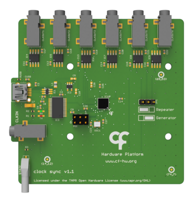

## Harp Clock Synchronizer ##

Outputs clock synchronization for up to 6 Harp devices when in "Generator" mode. If there is a need to synchronize more devices, the device can be set to "Repeater" mode and receive a master clock signal from another Clock Synchronizer device set to "Generator" mode.

### Key Features ###

* Can be used as a Generator (up to 6 devices) or Repeater.
* Synchronization error: ± 42 µS

### Connectivity ###

* 1x clock sync input (CLKIN) [stereo jack]
* 1x USB (for power) [USB type B]
* 6x clock sync output (CLKOUT1 to CLKOUT6) [stereo jack]

## Interface ##

The interface with the Harp board can be done through [Bonsai](https://bonsai-rx.org/).

## Licensing ##

Each subdirectory will contain a license or, possibly, a set of licenses if it involves both hardware and software.
